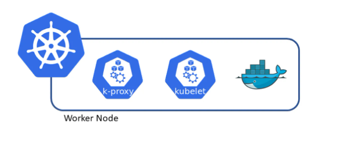

# Worker Node Elemanları

### Worker Node Nedir?
Uygulamaların çalıştığı, Kubernetes objelerinin gerçekten barındığı node'lardır. Worker node şu bileşenleri içerir:

# Kubelet
Her worker node'da bulunan temel bileşendir. Pod'ların çalıştırılmasından sorumludur. Pod'un sağlık durumunu ve kaynak kullanımını takip eder ve durumu Control Plane'e rapor eder.

# Kube-proxy
Kubernetes'deki ağ trafiğini yönetir. Cluster servisleri için bağlantı yönlendirme ve yük dengeleme işlemlerini gerçekleştirir. Kube-proxy, farklı modlarda çalışabilir:

- **Userspace**: Eski ve daha az verimli bir yöntemdir. Bağlantı yönlendirme işlemleri kullanıcı alanında gerçekleşir.
- **iptables**: Daha verimli bir yöntemdir. Ağ kuralları iptables kullanılarak uygulanır.
- **ipvs** (varsayılan, destekleniyorsa): IP Virtual Server (ipvs) kullanılarak yapılan yük dengeleme, yüksek performans ve daha fazla özelleştirme seçeneği sunar.

# Container Runtime
Containerları çalıştıran bileşendir. Kubernetes, CRI (Container Runtime Interface) uyumlu bir runtime kullanır. Örnek container runtimelar şunlardır:

  - Containerd
  - CRI-O
  - Rkt
  - Kata Containers (eski adıyla Clear Containers ve Hyper)
  - Virtlet
